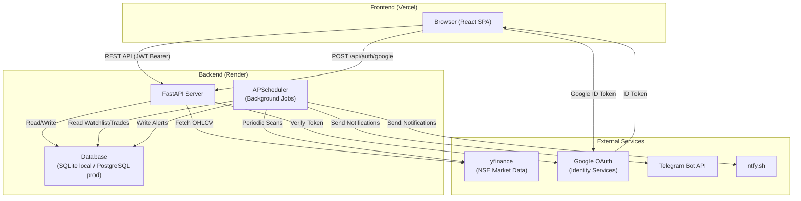
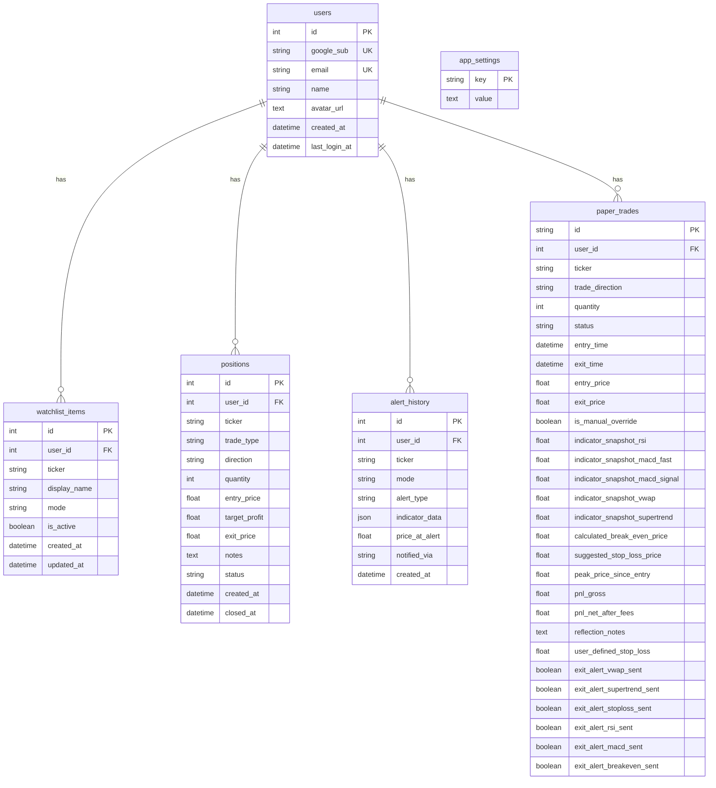
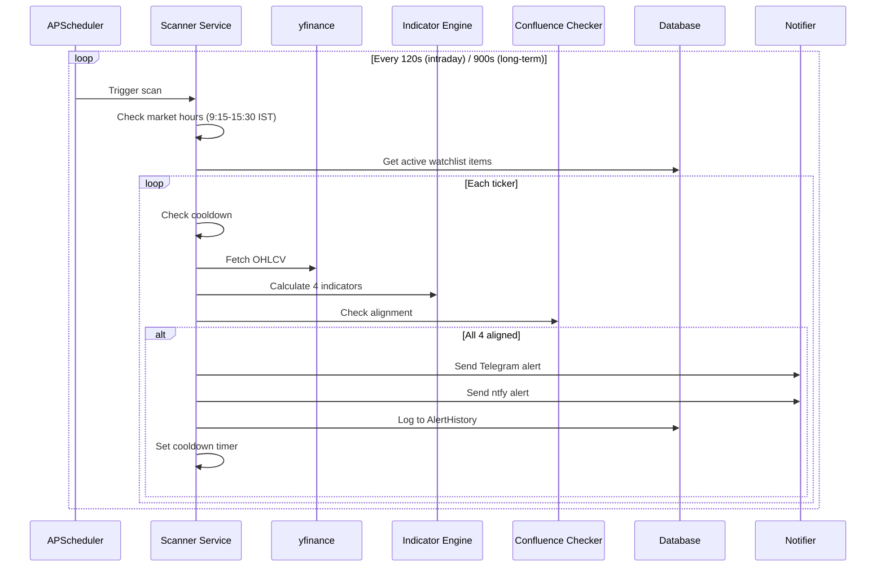
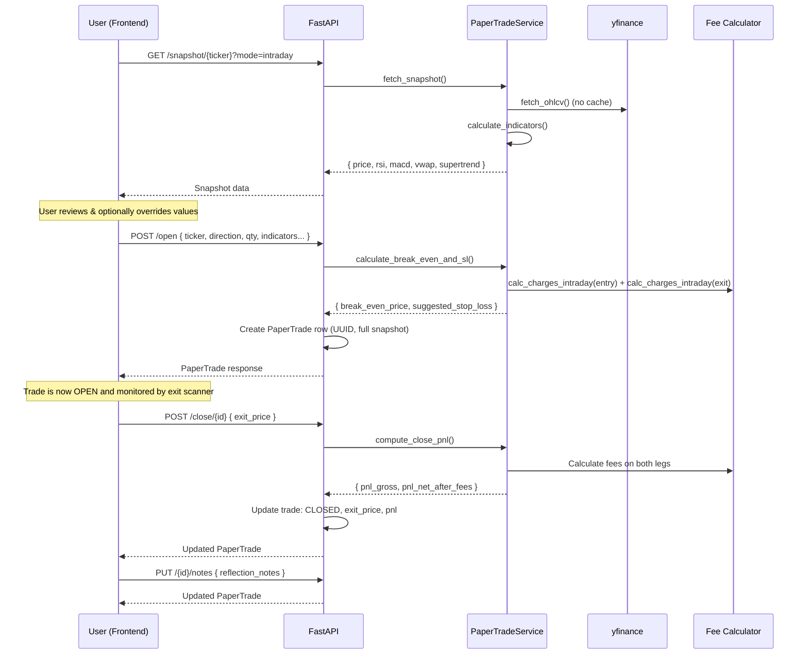
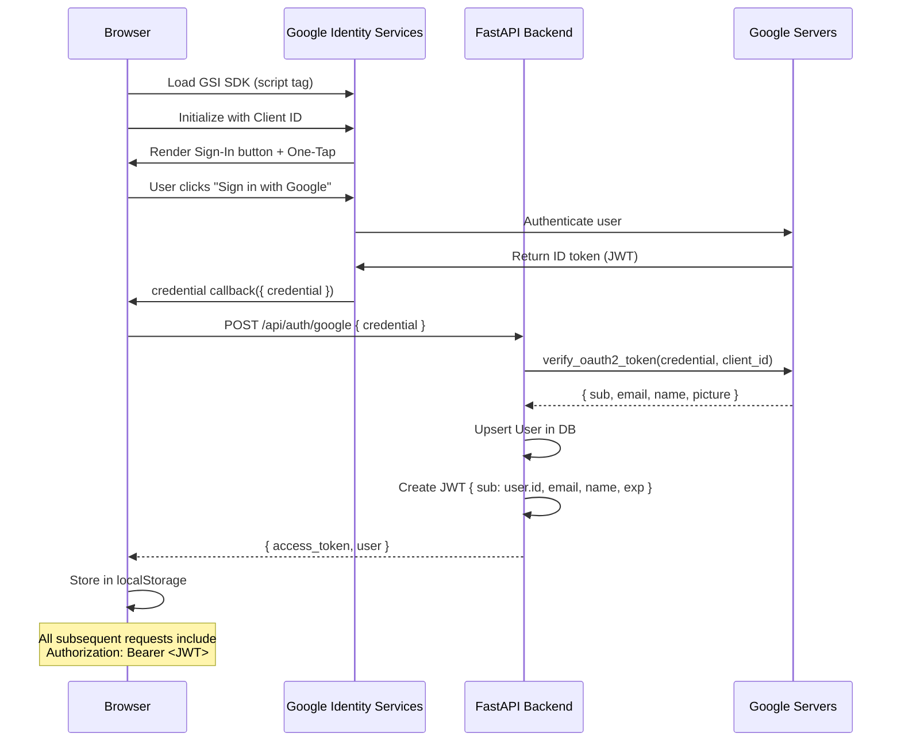

# TradeSentinel — Complete Project Documentation

> **One document to understand everything.** This file covers the project's purpose, architecture, every backend service, every frontend component, all business logic, all API endpoints, the full database schema, deployment configuration, and data flow — end to end.

---

## Table of Contents

1. [Project Overview](#1-project-overview)
2. [Technology Stack](#2-technology-stack)
3. [Project Structure](#3-project-structure)
4. [Architecture & Data Flow](#4-architecture--data-flow)
5. [Backend — Deep Dive](#5-backend--deep-dive)
   - 5.1 [Entry Point & Lifecycle (`main.py`)](#51-entry-point--lifecycle-mainpy)
   - 5.2 [Configuration (`config.py`)](#52-configuration-configpy)
   - 5.3 [Database Layer (`database.py`)](#53-database-layer-databasepy)
   - 5.4 [ORM Models (`models.py`)](#54-orm-models-modelspy)
   - 5.5 [Pydantic Schemas (`schemas.py`)](#55-pydantic-schemas-schemaspy)
   - 5.6 [Routers (API Endpoints)](#56-routers-api-endpoints)
   - 5.7 [Services (Business Logic)](#57-services-business-logic)
   - 5.8 [Utilities](#58-utilities)
6. [Frontend — Deep Dive](#6-frontend--deep-dive)
   - 6.1 [Entry Point & Providers](#61-entry-point--providers)
   - 6.2 [Routing & App Shell](#62-routing--app-shell)
   - 6.3 [API Client Layer](#63-api-client-layer)
   - 6.4 [Auth System (Context + Components)](#64-auth-system-context--components)
   - 6.5 [Pages](#65-pages)
   - 6.6 [Components](#66-components)
   - 6.7 [Styling](#67-styling)
7. [Complete API Reference](#7-complete-api-reference)
8. [Database Schema (Full ERD)](#8-database-schema-full-erd)
9. [Business Logic — The 4-Indicator Confluence Engine](#9-business-logic--the-4-indicator-confluence-engine)
10. [Background Scanner System](#10-background-scanner-system)
11. [Paper Trade System — Full Flow](#11-paper-trade-system--full-flow)
12. [Notification System](#12-notification-system)
13. [NSE Fee Calculator Logic](#13-nse-fee-calculator-logic)
14. [Exit Alert Engine](#14-exit-alert-engine)
15. [Authentication Flow (Google OAuth → JWT)](#15-authentication-flow-google-oauth--jwt)
16. [Environment Variables](#16-environment-variables)
17. [Deployment](#17-deployment)
18. [Local Development Setup](#18-local-development-setup)
19. [Key Design Decisions & Trade-offs](#19-key-design-decisions--trade-offs)

---

## 1. Project Overview

**TradeSentinel** (internally also called "TradingHelper") is a full-stack educational trading platform built for the **Indian National Stock Exchange (NSE)**. It allows users to:

- **Track stocks** across two distinct trading modes: Intraday and Long-Term (Delivery).
- **View interactive charts** with candlestick data, VWAP/EMA overlays, Supertrend, RSI, and MACD — all powered by real NSE market data via yfinance.
- **Receive confluence alerts** when all 4 technical indicators align simultaneously — pushed via Telegram and/or ntfy.sh. (Indicators are explicitly graded as BUY, SELL, or NEUTRAL).
- **Practice paper trading** with virtual capital, capturing exact indicator snapshots at entry, auto-calculating NSE-fee-adjusted break-even prices and stop-loss levels, tracking P&L on close.
- **Maintain a trading journal** with reflection notes on each trade.
- **Monitor positions** with a break-even calculator that factors in all Indian statutory charges (brokerage, STT, exchange fees, stamp duty, GST, SEBI fee).
- **Get exit alerts** on open paper trades when stop-loss or take-profit conditions are triggered in real time.

> **Educational use only** — not financial advice. The platform is designed for learning and practicing trading strategies without financial risk.

---

## 2. Technology Stack

### Frontend
| Technology | Version | Purpose |
|---|---|---|
| React | 19.2.x | UI framework |
| Vite | 8.1.x | Build tool & dev server |
| React Router DOM | 7.18.x | Client-side routing |
| TanStack React Query | 5.101.x | Server state management, caching, auto-refetching |
| Lightweight Charts | 4.1.x | TradingView-style interactive charting |
| Axios | 1.18.x | HTTP client for API calls |
| Lucide React | 1.25.x | Icon library |
| Google Identity Services SDK | (CDN) | Google Sign-In button & One-Tap |

### Backend
| Technology | Version | Purpose |
|---|---|---|
| FastAPI | 0.115.x+ | Async Python web framework |
| Uvicorn | 0.30.x+ | ASGI server |
| SQLAlchemy | 2.0+ | Async ORM |
| aiosqlite | 0.20.x+ | SQLite async driver (local dev) |
| asyncpg | 0.29.x+ | PostgreSQL async driver (production) |
| Pydantic | 2.0+ | Request/response validation |
| Pydantic Settings | 2.0+ | Environment-based config |
| yfinance | 0.2.40+ | Market data provider (NSE via `.NS` suffix) |
| pandas | 2.2.x+ | DataFrame manipulation |
| pandas-ta-classic | 0.3.14b+ | Technical indicator calculations |
| APScheduler | 3.10.x+ | Background job scheduling |
| python-jose | 3.3.x+ | JWT encoding/decoding |
| google-auth | 2.30.x+ | Server-side Google ID token verification |
| passlib | 1.7.x+ | Password hashing utilities |
| httpx | 0.27.x+ | Async HTTP client (Telegram/ntfy notifications) |
| python-dotenv | 1.0.x+ | `.env` file loading |

### Deployment
| Service | Role |
|---|---|
| **Render** | Backend hosting (FastAPI + PostgreSQL) |
| **Vercel** | Frontend hosting (static SPA) |
| **Telegram Bot API** | Push notification channel |
| **ntfy.sh** | Push notification channel (mobile) |

---

## 3. Project Structure

```
TradeSentinel/
├── backend/                          # FastAPI Backend
│   ├── app/
│   │   ├── __init__.py
│   │   ├── main.py                   # App entry, lifespan, CORS, router registration
│   │   ├── config.py                 # Settings from env vars (pydantic-settings)
│   │   ├── database.py               # Async engine, session maker, init_db
│   │   ├── models.py                 # SQLAlchemy ORM models (6 tables)
│   │   ├── schemas.py                # Pydantic request/response schemas
│   │   ├── routers/
│   │   │   ├── __init__.py
│   │   │   ├── auth.py               # Google OAuth login, JWT, /me
│   │   │   ├── watchlist.py          # CRUD for 2-mode watchlist
│   │   │   ├── market_data.py        # Chart data, indicators, search, price
│   │   │   ├── positions.py          # Position tracker + break-even calculator
│   │   │   ├── alerts.py             # Alert history + notification settings
│   │   │   └── paper_trade.py        # Paper trade journal (open, close, notes)
│   │   ├── services/
│   │   │   ├── __init__.py
│   │   │   ├── data_fetcher.py       # yfinance wrapper with TTL caching
│   │   │   ├── indicators.py         # VWAP, EMA-200, Supertrend, RSI, MACD
│   │   │   ├── confluence.py         # 4-indicator alignment checker
│   │   │   ├── calculator.py         # Break-even & target price solver
│   │   │   ├── scanner.py            # APScheduler background scanner
│   │   │   ├── exit_scanner.py       # Conditional exit alert engine
│   │   │   ├── paper_trade_service.py# Snapshot, break-even/SL, PnL logic
│   │   │   └── notifier.py           # Telegram + ntfy dispatch
│   │   └── utils/
│   │       ├── __init__.py
│   │       ├── auth_utils.py         # JWT create/decode, get_current_user dep
│   │       └── charges.py            # NSE statutory charges calculation
│   ├── .env                          # Local environment variables (gitignored)
│   ├── .env.example                  # Template for env vars
│   ├── requirements.txt              # Python dependencies
│   ├── render.yaml                   # Render.com deployment blueprint
│   └── tradinghelper.db              # Local SQLite database (gitignored)
│
├── frontend/                         # React (Vite) Frontend
│   ├── src/
│   │   ├── main.jsx                  # React root, providers (Query, Router)
│   │   ├── App.jsx                   # Route definitions
│   │   ├── index.css                 # Global CSS design system
│   │   ├── api/
│   │   │   └── client.js             # Axios instance + all API functions
│   │   ├── contexts/
│   │   │   └── AuthContext.jsx        # Auth state, Google login/logout
│   │   ├── components/
│   │   │   ├── Auth/
│   │   │   │   └── ProtectedRoute.jsx # Route guard (redirect to /login)
│   │   │   ├── Chart/
│   │   │   │   ├── ChartContainer.jsx # Orchestrates chart + sub-panels
│   │   │   │   ├── PriceChart.jsx     # Candlestick + overlays (VWAP/EMA/ST)
│   │   │   │   ├── RSIPanel.jsx       # RSI sub-chart with 30/70 zones
│   │   │   │   ├── MACDPanel.jsx      # MACD line + signal + histogram
│   │   │   │   └── Chart.css
│   │   │   ├── Layout/
│   │   │   │   ├── Layout.jsx         # Sidebar + Header + content area
│   │   │   │   ├── Sidebar.jsx        # Navigation sidebar
│   │   │   │   ├── Header.jsx         # Top bar with search + user menu
│   │   │   │   └── Layout.css
│   │   │   ├── PaperTrade/
│   │   │   │   ├── PaperTradeModal.jsx # Full modal for opening paper trades
│   │   │   │   └── PaperTrade.css
│   │   │   └── Watchlist/
│   │   │       ├── WatchlistPanel.jsx  # Single-mode watchlist column
│   │   │       ├── AddTickerModal.jsx  # Search + add ticker dialog
│   │   │       └── Watchlist.css
│   │   └── pages/
│   │       ├── DashboardPage.jsx      # 2-column watchlist + recent alerts
│   │       ├── ChartPage.jsx          # Full chart view with indicators
│   │       ├── PositionsPage.jsx      # Position tracker + calculator
│   │       ├── AlertsPage.jsx         # Alert history + settings
│   │       ├── JournalPage.jsx        # Paper trade journal
│   │       ├── LoginPage.jsx          # Google Sign-In page
│   │       ├── LoginPage.css
│   │       └── Pages.css
│   ├── index.html                     # HTML shell (Google SDK, fonts)
│   ├── package.json
│   ├── vite.config.js
│   ├── vercel.json                    # Vercel SPA rewrite rules
│   └── .env.example                   # Frontend env template
│
├── .gitignore
├── Makefile                           # `make dev`, `make backend`, `make frontend`
├── run.sh                             # Bash script to start both servers
└── README.md
```

---

## 4. Architecture & Data Flow



### Request Flow (Typical)

1. **User opens app** → React SPA loads from Vercel
2. **Google Sign-In** → GSI SDK returns an ID token → frontend sends it to `POST /api/auth/google`
3. **Backend verifies** the ID token with Google servers → upserts user → returns a JWT
4. **Frontend stores JWT** in `localStorage` → Axios interceptor attaches it as `Authorization: Bearer <token>` on every request
5. **Protected API calls** → backend extracts JWT → decodes it → loads User from DB → scopes all queries to that user
6. **Chart data** → backend fetches OHLCV from yfinance → calculates indicators via pandas-ta → returns time-series JSON
7. **Background scanner** (APScheduler) → periodically fetches data for all active watchlist items → checks confluence → sends alerts via Telegram/ntfy if all 4 indicators align

---

## 5. Backend — Deep Dive

### 5.1 Entry Point & Lifecycle (`main.py`)

**File:** `backend/app/main.py`

The FastAPI app is created with a **lifespan context manager** that handles startup and shutdown:

**On Startup:**
1. `init_db()` — creates all database tables (via `Base.metadata.create_all`)
2. `create_scheduler()` — creates and starts the APScheduler with all background scan jobs
3. Logs readiness with scanner interval info

**On Shutdown:**
1. `scheduler.shutdown(wait=False)` — stops background jobs

**CORS** is configured from `settings.cors_origins` (defaults to `localhost:5173` and `localhost:3000`, but can be overridden via env var for production).

**Routers registered:**
- `auth.router` — `/api/auth/*`
- `watchlist.router` — `/api/watchlist/*`
- `market_data.router` — `/api/market/*`
- `positions.router` — `/api/positions/*`
- `alerts.router` — `/api/alerts/*`
- `paper_trade.router` — `/api/paper-trade/*`

**Health check:** `GET /api/health` returns `{ status: "healthy", app: "TradingHelper", version: "1.0.0" }`

---

### 5.2 Configuration (`config.py`)

**File:** `backend/app/config.py`

Uses `pydantic-settings` to load all config from environment variables (with `.env` file support):

| Setting | Default | Description |
|---|---|---|
| `database_url` | `sqlite+aiosqlite:///./tradinghelper.db` | Database connection string |
| `telegram_bot_token` | `""` | Telegram Bot API token |
| `telegram_chat_id` | `""` | Telegram chat/group ID |
| `ntfy_topic` | `""` | ntfy.sh topic for push notifications |
| `scan_interval_intraday_seconds` | `120` | How often to scan intraday watchlist |
| `scan_interval_longterm_seconds` | `900` | How often to scan long-term watchlist |
| `alert_cooldown_intraday_minutes` | `30` | Min time between repeat alerts for same ticker (intraday) |
| `alert_cooldown_longterm_hours` | `24` | Min time between repeat alerts for same ticker (long-term) |
| `market_open_hour` / `minute` | `9:15` | NSE market open time (IST) |
| `market_close_hour` / `minute` | `15:30` | NSE market close time (IST) |
| `cors_origins` | `["http://localhost:5173", "http://localhost:3000"]` | Allowed CORS origins (comma-separated string or JSON array) |
| `google_client_id` | `""` | Google OAuth 2.0 Client ID |
| `jwt_secret` | `"change-me-..."` | Secret key for signing JWTs |
| `jwt_algorithm` | `HS256` | JWT signing algorithm |
| `jwt_expire_minutes` | `10080` (7 days) | JWT token expiration |

The `get_settings()` function is cached with `@lru_cache` — creating a singleton.

---

### 5.3 Database Layer (`database.py`)

**File:** `backend/app/database.py`

- **Dual-database support:** Automatically detects the `DATABASE_URL` prefix and creates the appropriate async engine:
  - `sqlite` → uses `aiosqlite` with `check_same_thread=False`
  - `postgres://` or `postgresql://` → rewrites to `postgresql+asyncpg://`
- **Session factory:** `async_sessionmaker` with `expire_on_commit=False`
- **Dependency:** `get_db()` is a FastAPI dependency that yields an `AsyncSession` and closes it after the request
- **`init_db()`:** Called on startup to create all tables via `Base.metadata.create_all`
- The engine and session maker are lazily initialized (singletons via `_get_engine()` / `_get_session_maker()`)

---

### 5.4 ORM Models (`models.py`)

**File:** `backend/app/models.py`

Six SQLAlchemy models define the database schema:

#### `User`
| Column | Type | Notes |
|---|---|---|
| `id` | Integer (PK, autoincrement) | Internal user ID |
| `google_sub` | String(128), unique, indexed | Google's unique subject identifier |
| `email` | String(255), unique | User's email |
| `name` | String(200) | Display name |
| `avatar_url` | Text, nullable | Google profile picture URL |
| `created_at` | DateTime | Registration timestamp |
| `last_login_at` | DateTime | Updated on each login |

#### `WatchlistItem`
| Column | Type | Notes |
|---|---|---|
| `id` | Integer (PK) | |
| `user_id` | Integer (FK → users.id), indexed | Owner |
| `ticker` | String(20) | NSE symbol (e.g., "RELIANCE") |
| `display_name` | String(100), nullable | Human-readable name |
| `mode` | String(20) | `"intraday"` \| `"long_term"` |
| `is_active` | Boolean | Whether the scanner should scan this |
| `created_at` | DateTime | |
| `updated_at` | DateTime | Auto-updated |

#### `Position`
| Column | Type | Notes |
|---|---|---|
| `id` | Integer (PK) | |
| `user_id` | Integer (FK → users.id), indexed | |
| `ticker` | String(20) | |
| `trade_type` | String(20) | `"intraday"` \| `"long_term"` |
| `direction` | String(4) | `"BUY"` \| `"SELL"` |
| `quantity` | Integer | |
| `entry_price` | Float | |
| `target_profit` | Float, nullable | Target in ₹ |
| `exit_price` | Float, nullable | Stores calculated break-even price |
| `notes` | Text, nullable | |
| `status` | String(10) | `"OPEN"` \| `"CLOSED"` |
| `created_at` | DateTime | |
| `closed_at` | DateTime, nullable | |

#### `AlertHistory`
| Column | Type | Notes |
|---|---|---|
| `id` | Integer (PK) | |
| `user_id` | Integer (FK → users.id), indexed | |
| `ticker` | String(20) | |
| `mode` | String(20) | |
| `alert_type` | String(30) | `"confluence_bullish"` \| `"confluence_bearish"` \| `"exit_stoploss"` \| `"exit_takeprofit"` |
| `indicator_data` | JSON, nullable | Full indicator snapshot at alert time |
| `price_at_alert` | Float | |
| `notified_via` | String(20), nullable | `"telegram"`, `"ntfy"`, `"telegram,ntfy"`, or `"none"` |
| `created_at` | DateTime | |

#### `AppSettings`
| Column | Type | Notes |
|---|---|---|
| `key` | String(50) (PK) | Setting key (e.g., `"telegram_bot_token"`) |
| `value` | Text | Setting value |

A key-value store for runtime-configurable settings (notification credentials, scan intervals). Updated via the Alerts settings UI.

#### `PaperTrade`
| Column | Type | Notes |
|---|---|---|
| `id` | String(36) (PK) | UUID |
| `user_id` | Integer (FK → users.id), indexed | |
| `ticker` | String(20), indexed | |
| `trade_direction` | String(20) | `"INTRADAY_BUY"` \| `"INTRADAY_SHORT"` \| `"LONG_TERM_BUY"` \| `"LONG_TERM_SELL"` |
| `quantity` | Integer | |
| `status` | String(10) | `"OPEN"` \| `"CLOSED"` |
| `entry_time` | DateTime | |
| `exit_time` | DateTime, nullable | |
| `entry_price` | Float | |
| `exit_price` | Float, nullable | |
| `is_manual_override` | Boolean | True if user edited auto-fetched values |
| `indicator_snapshot_rsi` | Float | RSI at entry |
| `indicator_snapshot_macd_fast` | Float | MACD line at entry |
| `indicator_snapshot_macd_signal` | Float | MACD signal at entry |
| `indicator_snapshot_vwap` | Float, nullable | VWAP at entry (intraday only) |
| `indicator_snapshot_supertrend` | Float | Supertrend value at entry |
| `calculated_break_even_price` | Float | NSE-fee-adjusted break-even |
| `suggested_stop_loss_price` | Float | Auto-suggested SL level |
| `peak_price_since_entry` | Float, nullable | Highest close since entry for trailing stop |
| `pnl_gross` | Float, nullable | Populated on close |
| `pnl_net_after_fees` | Float, nullable | Populated on close |
| `reflection_notes` | Text, nullable | Trading journal entry |
| `user_defined_stop_loss` | Float, nullable | User-overridden SL |
| `exit_alert_vwap_sent` | Boolean | Cooldown flag — reset when condition clears |
| `exit_alert_supertrend_sent` | Boolean | Cooldown flag |
| `exit_alert_stoploss_sent` | Boolean | Cooldown flag |
| `exit_alert_rsi_sent` | Boolean | Cooldown flag |
| `exit_alert_macd_sent` | Boolean | Cooldown flag |
| `exit_alert_breakeven_sent` | Boolean | One-shot flag (never resets) |

---

### 5.5 Pydantic Schemas (`schemas.py`)

**File:** `backend/app/schemas.py`

Defines all request/response models with validation:

- **Watchlist:** `WatchlistItemCreate`, `WatchlistItemUpdate`, `WatchlistItemResponse`
- **Positions:** `PositionCreate`, `PositionUpdate`, `PositionResponse`, `BreakEvenRequest`, `BreakEvenResponse`
- **Alerts:** `AlertResponse`, `AlertSettingsUpdate`, `NtfyTestRequest`, `TestTelegramRequest`
- **Market Data:** `ChartDataRequest`, `IndicatorStatus`
- **Paper Trades:** `SnapshotResponse`, `OpenPaperTradeRequest`, `ClosePaperTradeRequest`, `NotesUpdateRequest`, `PaperTradeResponse`

All response models use `model_config = {"from_attributes": True}` for direct ORM-to-schema serialization.

Key validations:
- `mode` must match pattern `^(intraday|long_term)$`
- `direction` must match `^(BUY|SELL)$`
- `interval` must match `^(1m|5m|15m|1h|1d|1wk)$`
- `quantity` must be `> 0`, `entry_price` must be `> 0`

---

### 5.6 Routers (API Endpoints)

#### Auth Router — `POST /api/auth/google`, `GET /api/auth/me`, `POST /api/auth/logout`

**File:** `backend/app/routers/auth.py`

- **`POST /api/auth/google`**: Accepts `{ credential: "<Google ID token>" }`, verifies with Google's servers using `google.oauth2.id_token.verify_oauth2_token`, upserts the User in DB, returns a signed JWT + user profile.
- **`GET /api/auth/me`**: Validates the JWT from the `Authorization` header, returns the current user's profile.
- **`POST /api/auth/logout`**: Stateless no-op (returns 204). Client discards its JWT.

#### Watchlist Router — `/api/watchlist/*`

**File:** `backend/app/routers/watchlist.py`

- **`GET /`**: List all watchlist items across all modes (scoped to current user), ordered by mode then creation date.
- **`GET /{mode}`**: List items for a specific mode (`intraday`, `long_term`).
- **`POST /`**: Add a ticker. Auto-normalizes to uppercase. Checks for duplicates within the same user+mode. Auto-fetches `display_name` from yfinance if not provided.
- **`PUT /{item_id}`**: Update ticker, display name, mode, or active status.
- **`DELETE /{item_id}`**: Remove a ticker from a watchlist.

#### Market Data Router — `/api/market/*`

**File:** `backend/app/routers/market_data.py`

- **`GET /chart/{ticker}`**: Returns full OHLCV candle data + all indicator time-series (VWAP/EMA, Supertrend, RSI, MACD) in TradingView Lightweight Charts format. Accepts `interval`, `period`, and `mode` as query params.
- **`GET /indicators/{ticker}`**: Returns current (latest) indicator values + confluence check result. Mode determines interval/period: intraday → 5m/5d, long_term → 1wk/5y. Uses `ThreadPoolExecutor` for concurrent fetching in batches.
- **`GET /search?q=...`**: Search for NSE tickers by symbol (uses yfinance Ticker info lookup).
- **`GET /price/{ticker}`**: Get the latest price for a ticker (1-minute interval, latest close).

#### Positions Router — `/api/positions/*`

**File:** `backend/app/routers/positions.py`

- **`GET /`**: List all positions (optionally filtered by `status=OPEN|CLOSED`).
- **`POST /`**: Create a new position. Auto-calculates break-even price using the fee calculator and stores it as `exit_price`.
- **`PUT /{position_id}`**: Update status, target profit, or notes. If target_profit changes, recalculates exit price. If status changes to CLOSED, sets `closed_at`.
- **`DELETE /{position_id}`**: Remove a position.
- **`POST /calculate`**: Stateless break-even calculation. Takes trade parameters, returns break-even price, target price, and full charge breakdown — without saving anything.

#### Alerts Router — `/api/alerts/*`

**File:** `backend/app/routers/alerts.py`

- **`GET /`**: Paginated alert history (optional filters: `mode`, `ticker`, `limit`, `offset`).
- **`GET /count`**: Total alert count for the user.
- **`GET /settings`**: Read notification settings (Telegram/ntfy config) from the `AppSettings` table.
- **`PUT /settings`**: Upsert notification settings.
- **`POST /test-telegram`**: Send a test message to verify Telegram configuration.
- **`POST /test-ntfy`**: Send a test push notification to verify ntfy configuration.

#### Paper Trade Router — `/api/paper-trade/*`

**File:** `backend/app/routers/paper_trade.py`

- **`GET /snapshot/{ticker}`**: Fetch live price + all 4 indicator values for a ticker. Used by the frontend modal before opening a trade. All values are editable by the user before confirming.
- **`POST /open`**: Open a new paper trade. Accepts indicator values (possibly user-overridden), calculates break-even and stop-loss via the fee calculator, persists the full snapshot.
- **`POST /close/{trade_id}`**: Close a trade at a given exit price. Calculates gross + net PnL (after NSE fees).
- **`PUT /{trade_id}/notes`**: Save/update reflection notes on a trade (trading journal).
- **`GET /`**: List all paper trades (optional filters: `status`, `ticker`), newest first.

---

### 5.7 Services (Business Logic)

#### Data Fetcher (`data_fetcher.py`)

**File:** `backend/app/services/data_fetcher.py`

**Purpose:** Wraps yfinance with in-memory TTL caching.

- **`_nse_ticker(ticker)`**: Ensures the `.NS` suffix (e.g., `"RELIANCE"` → `"RELIANCE.NS"`).
- **`_clean_columns(df)`**: Normalizes column names to lowercase; flattens MultiIndex columns.
- **`fetch_ohlcv(ticker, interval, period, use_cache)`**: Core data function. Returns a cleaned DataFrame with columns `[open, high, low, close, volume]` and a DatetimeIndex.
  - **Cache:** In-memory dict keyed by `(ticker, interval, period)`. TTL varies by interval: 1m→30s, 5m→60s, 15m→120s, 1h→300s, 1d→600s, 1wk→3600s.
- **`search_tickers(query)`**: Looks up a ticker via `yf.Ticker(query).info` and returns `[{ symbol, name, exchange, sector }]`.
- **`get_current_price(ticker)`**: Fetches 1-minute data for today, returns the latest close price.
- **`clear_cache()`**: Clears the entire in-memory cache.

#### Indicators (`indicators.py`)

**File:** `backend/app/services/indicators.py`

**Purpose:** Calculates all 4 technical indicators using pandas-ta-classic.

**`IndicatorResult` dataclass** holds:
- `price` — latest close
- `vwap` — Volume Weighted Average Price (intraday modes only)
- `ema_200` — 200-period Exponential Moving Average (long-term mode only)
- `supertrend_value`, `supertrend_direction` (1=bullish, -1=bearish)
- `rsi`, `rsi_prev`, `rsi_rising` (14-period RSI)
- `macd_line`, `macd_signal`, `macd_histogram`, `macd_crossover` ("bullish"/"bearish"/"none") — MACD(12,26,9)
- `series` — dict of full time-series (populated when `include_series=True` for charting)

**`calculate_indicators(df, mode, include_series)`:**
1. Validates minimum 30 rows of data
2. Calculates **VWAP** (intraday only) via `ta.vwap()`
3. Calculates **200 EMA** (long_term only) via `ta.ema(length=200)`
4. Calculates **Supertrend**(7, 3.0) via `ta.supertrend()` — extracts the `SUPERT_` and `SUPERTd_` columns
5. Calculates **RSI**(14) via `ta.rsi()` — determines if rising by comparing last two values
6. Calculates **MACD**(12, 26, 9) via `ta.macd()` — detects crossovers by comparing current vs previous MACD/signal relationship

**`get_chart_data(df, mode)`:** Builds the chart-ready response:
- `candles[]` — OHLCV in `{ time, open, high, low, close }` format (timestamps as Unix epoch)
- `indicators{}` — each indicator as `[{ time, value }]` arrays (Supertrend includes `color`)
- `latest{}` — latest values for the indicator status bar

#### Confluence (`confluence.py`)

**File:** `backend/app/services/confluence.py`

**Purpose:** The core decision engine. Checks if all 4 indicators are perfectly aligned.

**`ConfluenceResult` dataclass:** `is_aligned`, `mode`, `checks` (per-indicator pass/fail), `details` (human-readable strings).

**Three mode-specific checkers:**

| Check | Intraday (Buy) | Intraday (Short Sell) | Long-Term (Buy) |
|---|---|---|---|
| **Overlay** | Price > VWAP | Price < VWAP | Price > 200 EMA |
| **Supertrend** | Direction == 1 (Bullish) | Direction == -1 (Bearish) | Direction == 1 (Bullish) |
| **RSI** | 40 < RSI < 60, rising | 33 < RSI < 50, falling | 50 < RSI < 70, rising |
| **MACD** | MACD > Signal AND histogram > 0 | MACD < Signal AND histogram < 0 | MACD > Signal AND histogram > 0 |

`is_aligned = ALL checks must pass`

#### Calculator (`calculator.py`)

**File:** `backend/app/services/calculator.py`

**Purpose:** Calculates exact NSE-fee-adjusted break-even and target exit prices.

**`calculate_breakeven(trade_type, direction, quantity, entry_price, target_profit)`:**

For a **BUY** trade:
1. Calculate buy-side charges on `entry_price × quantity`
2. Total cost = buy_value + buy_charges
3. Iteratively solve for `exit_price` where: `exit_value - sell_charges = total_cost` (break-even) or `= total_cost + target_profit` (target)
4. Uses Newton-like iteration with charge-rate gradient (50 iterations, 0.005 tolerance)

For a **SELL** (short) trade:
1. Calculate sell-side charges on entry
2. Net proceeds = sell_value - sell_charges
3. Solve for cover price where: `cover_value + buy_charges = net_proceeds` (break-even)

Returns: entry_price, quantity, buy_value, breakeven_price, target_price, charges breakdown (both legs).

#### Scanner (`scanner.py`)

**File:** `backend/app/services/scanner.py`

**Purpose:** Background scanning engine using APScheduler.

**`create_scheduler()`** creates an `AsyncIOScheduler` (timezone: Asia/Kolkata) with 5 jobs:

| Job | Schedule | Function |
|---|---|---|
| Intraday Scanner | Every `scan_interval_intraday_seconds` | `scan_intraday()` |
| Long-Term Scanner | Every `scan_interval_longterm_seconds` | `scan_long_term()` |
| Exit Alert Scanner | Every `scan_interval_intraday_seconds` | `scan_exit_alerts()` |
| Alert Purge | Cron 15:35 IST daily | `purge_old_alerts()` |

**Scan Logic (`_scan_mode`):**
1. Check if within NSE market hours (9:15 AM – 3:30 PM IST, Mon-Fri). Skip intraday scans outside hours.
2. Query all active `WatchlistItem` rows for the given mode (across ALL users).
3. For each item:
   a. Check cooldown (skip if recently alerted)
   b. Fetch OHLCV data via `fetch_ohlcv()`
   c. Calculate indicators
   d. Check confluence
   e. If all 4 aligned → set cooldown, load notification settings from DB, send Telegram + ntfy, log to `AlertHistory`

**`purge_old_alerts()`:** Runs daily at 15:35 IST. Deletes AlertHistory rows older than 2 trading days (weekdays only — skips weekends). PaperTrade rows are **never** touched.

#### Exit Scanner (`exit_scanner.py`)

**File:** `backend/app/services/exit_scanner.py`

**Purpose:** Monitors all open paper trades for exit conditions.

Runs on every intraday scanner tick. For each open paper trade:
1. Fetches live OHLCV + calculates indicators
2. Delegates to `_evaluate_long_exit()` or `_evaluate_short_exit()`
3. Each condition uses a **boolean flag** on the PaperTrade row to prevent notification spam
4. Flags are **reset** when the condition clears (except break-even, which is one-shot)

**LONG trade exit conditions:**

Trigger a `LONG_TERM_SELL` exit if **ANY** of these 3 conditions are met:

| # | Condition | Category | Flag |
|---|---|---|---|
| 1 | Price closes below 50-W EMA | Stop-Loss | `exit_alert_vwap_sent` |
| 2 | Price drops 20% from peak since entry | Stop-Loss | `exit_alert_stoploss_sent` |
| 3 | Price closes > 5% below the 200-W SMA | Stop-Loss | `exit_alert_supertrend_sent` |

**SHORT trade exit conditions:**

| # | Condition | Category | Flag |
|---|---|---|---|
| 1 | Price > VWAP | Stop-Loss | `exit_alert_vwap_sent` |
| 2 | Supertrend flips bullish | Stop-Loss | `exit_alert_supertrend_sent` |
| 3 | Price > effective SL | Stop-Loss | `exit_alert_stoploss_sent` |
| 4 | RSI < 30 | Take-Profit | `exit_alert_rsi_sent` |
| 5 | MACD bullish crossover | Take-Profit | `exit_alert_macd_sent` |

Effective SL = `user_defined_stop_loss` (if set) → else `suggested_stop_loss_price`.

#### Paper Trade Service (`paper_trade_service.py`)

**File:** `backend/app/services/paper_trade_service.py`

Three key functions:

1. **`fetch_snapshot(ticker, mode)`**: Fetches OHLCV (bypasses cache), calculates indicators, returns `{ ticker, mode, price, rsi, macd_fast, macd_signal, vwap, supertrend, ema_200, timestamp }`.

2. **`calculate_break_even_and_sl(trade_direction, entry_price, quantity, vwap, supertrend, ema_200)`**: Calculates fee-adjusted break-even and suggested stop-loss:
   - **INTRADAY_BUY**: BE = entry + (total_fees / qty), SL = VWAP (or entry × 0.995)
   - **INTRADAY_SHORT**: BE = entry - (total_fees / qty), SL = VWAP if above entry, else supertrend (or entry × 1.005)
   - **LONG_TERM_BUY**: BE = entry + (total_fees / qty), SL = EMA 200 (or entry × 0.98)
   - **LONG_TERM_SELL**: Tracking existing holdings (exiting positions)

3. **`compute_close_pnl(trade_direction, entry_price, exit_price, quantity)`**: Calculates gross and net PnL:
   - Long: `(exit - entry) × qty - fees`
   - Short: `(entry - exit) × qty - fees`

#### Notifier (`notifier.py`)

**File:** `backend/app/services/notifier.py`

Two notification channels, each with entry-alert and exit-alert variants:

**Confluence Alerts (Entry):**
- `send_telegram_alert()` — Markdown-formatted message with indicator details
- `send_ntfy_alert()` — Push notification with tags (📈 for bullish, 📉 for bearish), priority 4

**Exit Alerts:**
- `send_exit_telegram_alert()` — MarkdownV2 formatted, includes alert type, reason, current price, unrealised PnL
- `send_exit_ntfy_alert()` — Priority 5 (max) for stop-loss, priority 4 for take-profit

**Test functions:**
- `test_telegram_connection()` — Sends a test message
- `test_ntfy_connection()` — Sends a test push notification

All functions fall back to settings if explicit tokens/topics aren't provided.

---

### 5.8 Utilities

#### Auth Utils (`auth_utils.py`)

**File:** `backend/app/utils/auth_utils.py`

- **`create_access_token(user)`**: Creates a JWT with payload `{ sub: user.id, email, name, avatar, exp }` signed with `jwt_secret` using `HS256`.
- **`_decode_token(token)`**: Decodes + verifies JWT. Raises 401 on failure.
- **`get_current_user(credentials, db)`**: FastAPI dependency. Extracts Bearer token from `Authorization` header → decodes JWT → loads User from DB by ID. Raises 401 if token is missing, invalid, or user not found.

#### Charges (`charges.py`)

**File:** `backend/app/utils/charges.py`

Models all Indian statutory trading charges for NSE:

**Intraday Charges:**
| Charge | Rate | Applied On |
|---|---|---|
| Brokerage | 0.03% | Both sides |
| STT | 0.025% | Sell side only |
| Exchange Txn | 0.00297% | Both sides |
| Stamp Duty | 0.003% | Buy side only |
| GST | 18% | On (brokerage + exchange txn) |
| SEBI Fee | ₹10/crore | Both sides |

**Delivery (CNC) Charges:**
| Charge | Rate | Applied On |
|---|---|---|
| Brokerage | 0% | (zero for discount brokers) |
| STT | 0.1% | Both sides |
| Exchange Txn | 0.00297% | Both sides |
| Stamp Duty | 0.015% | Buy side only |
| GST | 18% | On (brokerage + exchange txn) |
| SEBI Fee | ₹10/crore | Both sides |

Functions:
- `calc_charges_intraday(turnover, side)` → `{ brokerage, stt, exchange_txn, stamp_duty, gst, sebi_fee, total }`
- `calc_charges_delivery(turnover, side)` → same structure

---

## 6. Frontend — Deep Dive

### 6.1 Entry Point & Providers

**File:** `frontend/src/main.jsx`

The React app is bootstrapped with three wrapper providers:

```
StrictMode
  └── QueryClientProvider (React Query — staleTime: 30s, retry: 1)
       └── BrowserRouter (React Router)
            └── App
```

### 6.2 Routing & App Shell

**File:** `frontend/src/App.jsx`

| Path | Component | Auth Required |
|---|---|---|
| `/login` | `LoginPage` | No |
| `/` | `DashboardPage` | Yes |
| `/chart/:ticker` | `ChartPage` | Yes |
| `/positions` | `PositionsPage` | Yes |
| `/alerts` | `AlertsPage` | Yes |
| `/journal` | `JournalPage` | Yes |

All authenticated routes are wrapped in `<ProtectedRoute>` → `<Layout>`.

### 6.3 API Client Layer

**File:** `frontend/src/api/client.js`

Creates an Axios instance pointed at `VITE_API_BASE_URL` (defaults to `http://localhost:8000/api`).

**Request interceptor:** Reads JWT from `localStorage("th_access_token")` and attaches as `Authorization: Bearer <token>`.

**Response interceptor:** On 401, clears stored token + user, redirects to `/login`.

**Exported API modules:**
- `authApi` — `loginWithGoogle()`, `getMe()`, `logout()`
- `watchlistApi` — `listAll()`, `listByMode(mode)`, `add(data)`, `update(id, data)`, `remove(id)`
- `marketApi` — `getChart(ticker, interval, period, mode)`, `getIndicators(ticker, mode)`, `search(query)`, `getPrice(ticker)`
- `positionsApi` — `list(status)`, `create(data)`, `update(id, data)`, `remove(id)`, `calculate(data)`
- `alertsApi` — `list(params)`, `count()`, `getSettings()`, `updateSettings(data)`, `testTelegram(data)`, `testNtfy(topic)`
- `paperTradeApi` — `snapshot(ticker, mode)`, `open(data)`, `close(id, exitPrice)`, `updateNotes(id, notes)`, `list(params)`
- `healthApi` — `check()`

### 6.4 Auth System (Context + Components)

**File:** `frontend/src/contexts/AuthContext.jsx`

**State:**
- `user` — cached user profile (from localStorage on mount, refreshed via `/auth/me`)
- `token` — JWT string
- `loading` — true until session validation completes

**On mount:** If a stored token exists, calls `GET /api/auth/me` to validate it. On failure, clears everything.

**`login(googleCredential)`:** Posts to `/api/auth/google` → stores returned JWT + user in localStorage + state.

**`logout()`:** Calls `/api/auth/logout` → disables Google auto-select → clears localStorage + state.

**`ProtectedRoute` component:** Shows a spinner while `loading`, redirects to `/login` if no user, renders children if authenticated.

### 6.5 Pages

#### `LoginPage`
- Animated glassmorphism card with floating background orbs
- Google Identity Services (GSI) SDK button with One-Tap prompt
- Client ID read from `<meta>` tag in `index.html`
- On successful Google callback → calls `login()` → navigates to `/`

#### `DashboardPage`
- Two-column grid of `WatchlistPanel` components (Intraday and Long-Term)
- Recent alerts feed at the bottom (auto-refreshes every 30s)
- Each alert shows ticker, mode badge, price, RSI, and timestamp

#### `ChartPage`
- URL param: `/chart/:ticker`
- Interval selector bar (1m, 5m, 15m, 1H, 1D, 1W)
- Interval auto-maps to appropriate period and mode
- Confluence status card showing per-indicator pass/fail
- `ChartContainer` with three stacked panels: Price, RSI, MACD
- Auto-refreshes: 60s for intraday, 300s for daily/weekly

#### `PositionsPage`
- Position list (open/closed tabs)
- Break-even calculator form
- Full charge breakdown display

#### `AlertsPage`
- Alert history table with filters (mode, ticker)
- Notification settings panel (Telegram + ntfy configuration)
- Test buttons for both notification channels

#### `JournalPage`
- Paper trade list (open/closed tabs)
- Open trade modal (with live snapshot, editable indicators)
- Close trade flow
- Reflection notes editor
- P&L display

### 6.6 Components

#### Chart Components
- **`ChartContainer`**: Orchestrator — stacks indicator status bar + PriceChart + RSIPanel + MACDPanel
- **`PriceChart`**: TradingView Lightweight Charts candlestick chart with overlay series (VWAP/EMA-200 as line, Supertrend as colored line)
- **`RSIPanel`**: Separate chart for RSI with horizontal zones (30 oversold, 70 overbought)
- **`MACDPanel`**: Separate chart for MACD line, signal line, and histogram bars

#### Layout Components
- **`Layout`**: Grid layout — sidebar + header + content area
- **`Sidebar`**: Navigation links (Dashboard, Positions, Alerts, Journal) with icons from Lucide
- **`Header`**: Top bar with stock search, user avatar, logout button

#### Watchlist Components
- **`WatchlistPanel`**: Displays a single-mode watchlist (intraday/long-term). Shows ticker cards with last price (auto-refreshes). Now fetches live batch indicator summaries (e.g. 2↑, 1↓). Click to navigate to chart. Add/remove buttons.
- **`AddTickerModal`**: Search dialog — user types a symbol, backend searches yfinance, results shown, user selects to add to watchlist.

#### PaperTrade Components
- **`PaperTradeModal`**: Full-screen modal for opening a new paper trade. Fetches live snapshot, displays all 4 indicator values (editable), shows calculated break-even + stop-loss preview. User confirms to open the trade.

### 6.7 Styling

**File:** `frontend/src/index.css`

Global CSS design system using CSS custom properties:
- Dark theme with glassmorphism effects
- CSS variables for colors, spacing, typography
- Fonts: Inter (body), Outfit (headings), JetBrains Mono (monospace/numbers)
- Responsive grid layouts
- Animated elements (fade-in, pulse, floating orbs)
- Component-specific styles in dedicated `.css` files within each component directory

---

## 7. Complete API Reference

| Method | Endpoint | Auth | Description |
|---|---|---|---|
| `GET` | `/api/health` | No | Health check |
| `POST` | `/api/auth/google` | No | Exchange Google ID token for JWT |
| `GET` | `/api/auth/me` | Yes | Get current user profile |
| `POST` | `/api/auth/logout` | No | Stateless logout (204) |
| `GET` | `/api/watchlist/` | Yes | List all watchlist items |
| `GET` | `/api/watchlist/{mode}` | Yes | List items by mode |
| `POST` | `/api/watchlist/` | Yes | Add ticker to watchlist |
| `PUT` | `/api/watchlist/{id}` | Yes | Update watchlist item |
| `DELETE` | `/api/watchlist/{id}` | Yes | Remove watchlist item |
| `GET` | `/api/market/chart/{ticker}` | No | Get OHLCV + indicator chart data |
| `GET` | `/api/market/indicators/{ticker}` | No | Get current indicators + confluence |
| `GET` | `/api/market/search?q=...` | No | Search for NSE tickers |
| `GET` | `/api/market/price/{ticker}` | No | Get latest price |
| `GET` | `/api/positions/` | Yes | List positions |
| `POST` | `/api/positions/` | Yes | Create position (auto break-even) |
| `PUT` | `/api/positions/{id}` | Yes | Update position |
| `DELETE` | `/api/positions/{id}` | Yes | Delete position |
| `POST` | `/api/positions/calculate` | Yes | Stateless break-even calculation |
| `GET` | `/api/alerts/` | Yes | List alert history |
| `GET` | `/api/alerts/count` | Yes | Get alert count |
| `GET` | `/api/alerts/settings` | No | Get notification settings |
| `PUT` | `/api/alerts/settings` | No | Update notification settings |
| `POST` | `/api/alerts/test-telegram` | No | Send test Telegram message |
| `POST` | `/api/alerts/test-ntfy` | No | Send test ntfy notification |
| `GET` | `/api/paper-trade/snapshot/{ticker}` | Yes | Live indicator snapshot |
| `POST` | `/api/paper-trade/open` | Yes | Open paper trade |
| `POST` | `/api/paper-trade/close/{id}` | Yes | Close paper trade |
| `PUT` | `/api/paper-trade/{id}/notes` | Yes | Update reflection notes |
| `GET` | `/api/paper-trade/` | Yes | List paper trades |

---

## 8. Database Schema (Full ERD)



---

## 9. Business Logic — The 4-Indicator Confluence Engine

This is the core intelligence of TradeSentinel. The system checks whether **all 4** of the following technical indicators are simultaneously aligned for a given stock:

### Intraday (Buy Side) — 5-minute timeframe
1. **VWAP**: Price must be **above** VWAP (bullish momentum)
2. **Supertrend**: Must be **bullish** (direction == 1, green line below price)
3. **RSI**: Must be between **40-60** AND **rising** (momentum building, not overextended)
4. **MACD**: MACD line must be **above** signal line AND histogram **positive** (bullish state)

### Short Selling (Sell Side) — 5-minute timeframe
1. **VWAP**: Price must be **below** VWAP (bearish momentum)
2. **Supertrend**: Must be **bearish** (direction == -1, red line above price)
3. **RSI**: Must be between **33-50** AND **falling** (weakness, not oversold)
4. **MACD**: MACD line must be **below** signal line AND histogram **negative** (bearish state)

### Long-Term (Delivery) — Weekly timeframe
1. **200-W SMA**: Price must be **above** 200-W SMA (long-term uptrend)
2. **Supertrend**: Must be **bullish** (direction == 1)
3. **RSI**: Must be between **50-70**, **rising**, NOT overbought (strong but not exhausted)
4. **MACD**: MACD line must be **above** signal line AND histogram **positive**

**Long-Term Exits**: Exits use a Trend-Following & Trailing Stop architecture, rather than mean-reversion oscillators. A sell signal is triggered if ANY of the following structural breakdowns occur:
1. **Condition A:** Price closes below 50-W EMA.
2. **Condition B:** Price drops 20% from 52-Week High (scanner) or peak since entry (paper trades/backtest).
3. **Condition C:** Price closes > 5% below the 200-W SMA.

Only when **all 4 checks pass** does the system fire a confluence buy alert.

---

## 10. Background Scanner System



### Cooldown Logic
- **Intraday/Short Selling**: 30-minute cooldown per (ticker, mode) pair
- **Long-Term**: 24-hour cooldown per (ticker, mode) pair
- Prevents alert spam when indicators hover at the alignment boundary

### Alert Purge
- Runs daily at 15:35 IST (5 min after market close)
- Deletes AlertHistory rows older than 2 **trading days** (counts only Mon-Fri)
- PaperTrade rows are **never** deleted

---

## 11. Paper Trade System — Full Flow



---

## 12. Notification System

Two parallel channels, both used for entry (confluence) and exit alerts:

### Telegram Bot
- Uses Telegram Bot API via `httpx` POST to `https://api.telegram.org/bot{token}/sendMessage`
- Confluence alerts: Markdown format with indicator breakdown
- Exit alerts: MarkdownV2 format with alert type, reason, price, PnL
- Configured via `telegram_bot_token` + `telegram_chat_id` (env or AppSettings)

### ntfy.sh Push Notifications
- Uses ntfy.sh API via `httpx` POST to `https://ntfy.sh/{topic}`
- Headers: `Title`, `Priority` (4 for entry/take-profit, 5 for stop-loss), `Tags` (emoji)
- Configured via `ntfy_topic` (env or AppSettings)

Both channels are fire-and-forget — failures are logged but don't block the scanner.

---

## 13. NSE Fee Calculator Logic

The system accurately models all Indian statutory trading charges:

### Intraday/Short Selling:
```
Brokerage:      0.03% of turnover (per leg)
STT:            0.025% on SELL side only
Exchange Txn:   0.00297% of turnover
Stamp Duty:     0.003% on BUY side only
GST:            18% on (brokerage + exchange txn)
SEBI Fee:       ₹10 per crore of turnover
```

### Delivery (CNC):
```
Brokerage:      0% (zero for discount brokers)
STT:            0.1% on BOTH sides
Exchange Txn:   0.00297% of turnover
Stamp Duty:     0.015% on BUY side only
GST:            18% on (brokerage + exchange txn)
SEBI Fee:       ₹10 per crore of turnover
```

### Break-Even Solver
The break-even price is solved iteratively because sell-side charges are a function of the sell price itself. The solver uses Newton-like iteration:

1. Start with estimate = `required_amount / qty × 1.002` (0.2% friction buffer)
2. Calculate charges at current estimate
3. Compute error = `net - required`
4. Approximate gradient = `qty × (1 - charge_rate)`
5. Adjust: `estimate -= error / gradient`
6. Converges within 50 iterations with ₹0.005 tolerance

---

## 14. Exit Alert Engine

The exit scanner runs on every scheduler tick (same cadence as intraday scanner, typically every 120s).

### Alert Lifecycle:
1. **Condition triggers** → notification sent → flag set to `True` → no repeat alerts
2. **Condition clears** → flag reset to `False` → system can re-alert on next trigger
3. **Exception: Break-even reached** → one-shot, flag never resets (you crossed it; that's a permanent milestone)

### Stop-Loss Levels:
- **Effective SL** = `user_defined_stop_loss` (if manually set) → else `suggested_stop_loss_price` (auto-calculated)
- For LONG trades: SL hit when price drops **below** the level
- For SHORT trades: SL hit when price rises **above** the level

### Each exit alert logs to `AlertHistory` with:
- `alert_type`: `"exit_stoploss"` or `"exit_takeprofit"`
- `indicator_data`: JSON with signal name, reason, price, net PnL, trade ID, direction

---

## 15. Authentication Flow (Google OAuth → JWT)



### JWT Contents:
```json
{
  "sub": "1",           // Internal user ID
  "email": "user@example.com",
  "name": "User Name",
  "avatar": "https://...",
  "exp": 1234567890      // 7 days from issuance
}
```

### Session Validation on Mount:
- On every page load, `AuthContext` calls `GET /api/auth/me` to validate the stored JWT
- If 401 → clears localStorage, redirects to `/login`

---

## 16. Environment Variables

### Backend (`backend/.env`)
```env
DATABASE_URL=sqlite+aiosqlite:///./tradinghelper.db
TELEGRAM_BOT_TOKEN=your-bot-token-here
TELEGRAM_CHAT_ID=your-chat-id-here
SCAN_INTERVAL_INTRADAY_SECONDS=120
SCAN_INTERVAL_LONGTERM_SECONDS=900
ALERT_COOLDOWN_INTRADAY_MINUTES=30
ALERT_COOLDOWN_LONGTERM_HOURS=24
GOOGLE_CLIENT_ID=your-google-client-id
JWT_SECRET=your-long-random-secret-string
CORS_ORIGINS=http://localhost:5173,https://your-frontend.vercel.app
```

### Frontend (`frontend/.env.local`)
```env
VITE_API_BASE_URL=http://localhost:8000/api
```
In production: `VITE_API_BASE_URL=https://tradesentinel-api.onrender.com/api`

### Google OAuth Setup
1. Go to [Google Cloud Console](https://console.cloud.google.com/) → APIs & Services → Credentials
2. Create an OAuth 2.0 Client ID (Web application type)
3. Add authorized JavaScript origins: `http://localhost:5173` + production URL
4. Set the Client ID in:
   - `backend/.env` as `GOOGLE_CLIENT_ID`
   - `frontend/index.html` in the `<meta name="google-signin-client_id">` tag

---

## 17. Deployment

### Backend → Render

**File:** `backend/render.yaml`

```yaml
services:
  - type: web
    name: tradesentinel-api
    env: python
    region: oregon
    plan: free
    rootDir: backend
    buildCommand: "pip install -r requirements.txt"
    startCommand: "uvicorn app.main:app --host 0.0.0.0 --port $PORT"
    envVars:
      - key: DATABASE_URL        # From Render PostgreSQL
        fromDatabase:
          name: tradesentinel-db
          property: connectionString
      - key: GOOGLE_CLIENT_ID    # Manual
      - key: JWT_SECRET          # Manual
      - key: CORS_ORIGINS        # Manual (Vercel URL)
      - key: PYTHON_VERSION
        value: 3.11.9

databases:
  - name: tradesentinel-db
    region: oregon
    plan: free
    databaseName: tradesentinel
    user: tradesentinel
```

**Key points:**
- Uses Render's managed PostgreSQL (free tier)
- `DATABASE_URL` is auto-injected from the database service
- The `database.py` module auto-detects `postgres://` and rewrites to `postgresql+asyncpg://`
- Render automatically builds and deploys on git push

### Frontend → Vercel

**File:** `frontend/vercel.json`

```json
{
  "rewrites": [
    { "source": "/(.*)", "destination": "/index.html" }
  ]
}
```

**Key points:**
- Standard Vite build: `npm run build` → outputs to `dist/`
- SPA rewrite rule sends all routes to `index.html` (client-side routing)
- Set `VITE_API_BASE_URL` in Vercel dashboard environment variables
- Vite build bakes env vars at build time (via `import.meta.env`)

### Production URLs:
- **Backend API:** `https://tradesentinel-api.onrender.com`
- **Frontend:** Deployed on Vercel (URL depends on project settings)

---

## 18. Local Development Setup

### Prerequisites
- Node.js v18+
- Python 3.9+
- Git

### Backend Setup
```bash
cd backend
python -m venv venv
source venv/bin/activate    # Windows: venv\Scripts\activate
pip install -r requirements.txt
cp .env.example .env        # Edit with your Google Client ID, JWT secret, etc.
uvicorn app.main:app --reload --host 0.0.0.0 --port 8000
```
Backend available at `http://localhost:8000`. API docs at `http://localhost:8000/docs` (Swagger UI).

### Frontend Setup
```bash
cd frontend
npm install
cp .env.example .env.local  # Set VITE_API_BASE_URL=http://localhost:8000/api
npm run dev
```
Frontend available at `http://localhost:5173`.

### Run Both Together
```bash
./run.sh
# OR
make dev
```
The `run.sh` script starts both servers as background processes and traps `Ctrl+C` to stop both.

The Makefile uses `conda run -n ai` (for conda environments) — adjust if using venv.

---

## 19. Key Design Decisions & Trade-offs

| Decision | Rationale |
|---|---|
| **SQLite for local, PostgreSQL for prod** | Zero-config local dev; production-grade reliability in deployment. `database.py` auto-detects and creates the right engine. |
| **yfinance for market data** | Free, no API key required, sufficient for educational use. Limitation: data can lag 1-2 minutes behind live broker feeds. |
| **In-memory cache for OHLCV** | Prevents hammering yfinance on repeated requests. TTL varies by timeframe (30s for 1m, 600s for daily). |
| **APScheduler (not Celery)** | Lightweight, no Redis/RabbitMQ dependency. Sufficient for periodic scans. Runs in-process with the ASGI server. |
| **Google OAuth only (no email/password)** | Simplifies auth, avoids password management. Single sign-on for the target audience. |
| **Stateless JWT auth** | No server-side session store needed. 7-day expiration balances convenience with security. |
| **Per-trade exit alert flags** | Boolean flags on PaperTrade rows prevent notification spam while allowing re-notification when conditions oscillate. |
| **Break-even solved iteratively** | Charges are a function of the exit value, creating a circular dependency. Iterative solver converges quickly (< 50 iterations). |
| **All indicators calculated server-side** | Ensures consistency — the same calculation runs for charts, confluence checks, and exit alerts. |
| **Frontend caching via React Query** | 30s stale time, auto-refetch intervals per query. Minimizes API calls while keeping data fresh. |
| **No WebSockets** | Polling-based architecture (React Query refetchInterval) is simpler and sufficient for minute-level data. |
| **Dual notification channels** | Telegram for rich formatting; ntfy for instant mobile push without a Telegram account. |
| **Alert purge after 2 trading days** | Keeps the database lean while preserving recent context. PaperTrade history is permanent. |

---

> **This document represents the complete knowledge of the TradeSentinel codebase.** Every file, every function, every data flow, and every design decision is captured here.
